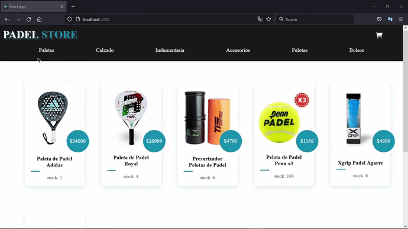

# Ecommerce - Padel Store
E-commerce desarrollado en React, diseñado para la venta de articulos deportivos orientados al padel.

## Demo

Recorrido completo de una compra.

## Funcionalidad
Al ingresar a la web podrás encontrar los productos que se encuentran a la venta. Tendrás la posibilidad de filtrarlos por categoria, facilitando la busqueda del producto que deseas. Al clickear sobre una card del producto, ingresaras al detalle de ese mismo producto, donde encontrarás todas las especificaciones del mismo y ademas, podras añadirlo al carrito.
Para ingresar a tu carrito de compras, solo debes clickear sobre el widget del carrito. Si no dispones de productos, toparas con un mensaje alusivo refiriendose a esto. En caso de disponer de productos en el carrito, podras remover unidades de los distintos productos o remover todo el carrito. Tambien, podras continuar con la finalizacion de la compra clickeando sobre el boton con dicho nombre. Por ultimo, para finalizar la compra, solo basta con completar el fomulario y darle al boton de "Finalizar compra". Si todo es correcto, se mostrara un mensaje alusivo, donde tambien encontraras el codigo de tu pedido. 

## Instalacion
Necesitarás tener [Node](http://nodejs.org/es/ "Node") >= 14.0.0 y [npm](https://www.npmjs.com/ "npm") >= 5.6 instalados en tu máquina. Para clonar el proyecto ejecuta en consola:

```bash
$ git clone https://github.com/Nicolas3150/padel-store-luna.git
```
Luego, ejecuta:

```bash
$ cd padel-store-luna
$ npm install
```
Esto último instalará todos los paquetes necesarios para el proyecto. Si el paquete ya estaba instalado va a intentar actualizarlo.

### Ejecucion
En el directorio del proyecto, puede ejecutar:
```bash
$ npm start
```
Ejecuta la aplicación en el modo de desarrollo. Abra http://localhost:3000 para verlo en su navegador.

---

#### Dependencias del proyecto
- [Font Awesome](https://fontawesome.com/v5/docs/web/use-with/react "Font Awesome")
- [React Router DOM](https://www.npmjs.com/package/react-router-dom "React Router DOM")
- [Firebase](https://firebase.google.com/?hl=es)
- [SweetAlert2](https://sweetalert2.github.io/)

#### Navegabilidad / Componentes
- Navbar con carrito implementado.
- Promises y Hooks.
- Routes y Links para navegaciones.
- Estilos adaptables.
- DOM & Syntethic Events.
- Eventos aplicativos persistentes.
- Context y CustomProviders.
- Rendering Condicional
- Firebase, Firestore y Queries.